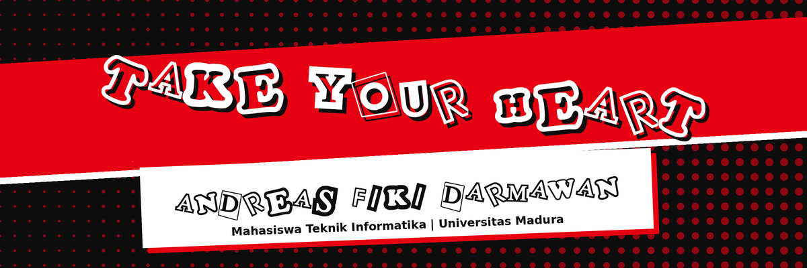

  

  
  

**Sedang dipelajari:** Dart / Flutter, C++, MariaDB

- **Tabulampot Tracker**: aplikasi pencatat perawatan tanaman (SvelteKit 5, TypeScript). Peran: frontend.
- **My Profile**: portofolio biodata HTML pertama saya, bertema Phantom Thieves.

> *"Live Must Go On."*
